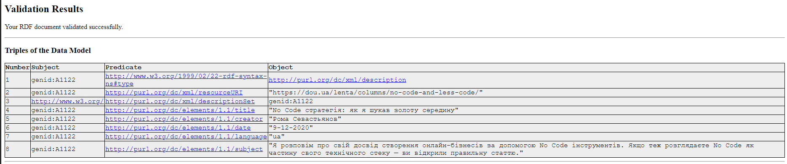

# Практичне завдання
1. Вивчити правила серіалізації RDF-графа за допомогою синтаксису Turtle, використовуючи http://www.w3.org/2007/02/turtle/primer/
2. Описати граф RDF із рис. 1.17 за допомогою RDF Turtle. Приклад взято з http://www.cse.lehigh.edu

3. Описати будь-яку статтю інтернет-видання (наприклад, http://news.cnet.com/8301-1023_3-5761428l-93/google-glass-gets-official-play-music-app/ ) за допомогою RDF/XML з використанням термінів Dublin Core http://dublincore.org/documents/2012/06/14/dcmi-terms/?v=terms
4. Перевірити опис за допомогою RDF/XML-валідатора http:// www.w3 .org/RDF/Validator/

5. Ознайомитися із текстом. Приватна початкова школа № 157 має трьох працівників: двох викладачів (Олена Геннадіївна, Дмитро Олегович) та директора Олександра Петровича. На додаток до адміністративних функцій директор займається також і викладанням. Олена Геннадіївна займається першокласниками, а Дмитро Олегович і Олександр Петрович разом викладають у других і третіх класах. Дмитро Олегович спеціалізується на спорті і, відтак, викладає фізичне виховання в третіх класах. У кожному класі навчається щонайменше один учень. Адаптовано з http://dbis.informatik.uni-freiburg.de/
    Описати цю інформацію за допомогою RDF/XML. Використати URI, порожні вершини, літерали та RDF-контейнери. Там, де доречно, застосувати словник rdfs, а саме такі властивості: rdfs:subClassOf, rdfs:subPropertyOf, rdfs:domain, rdfs:range.