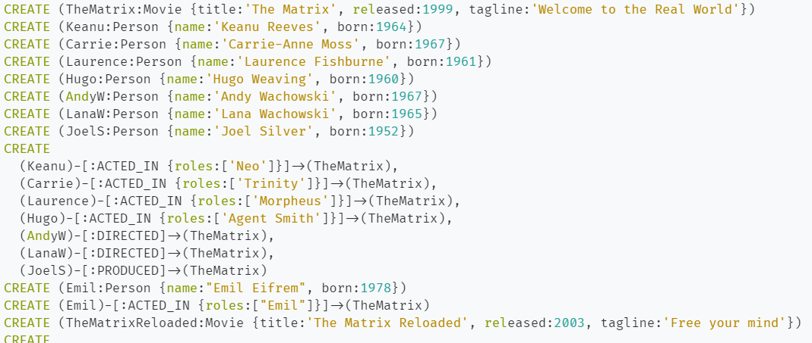
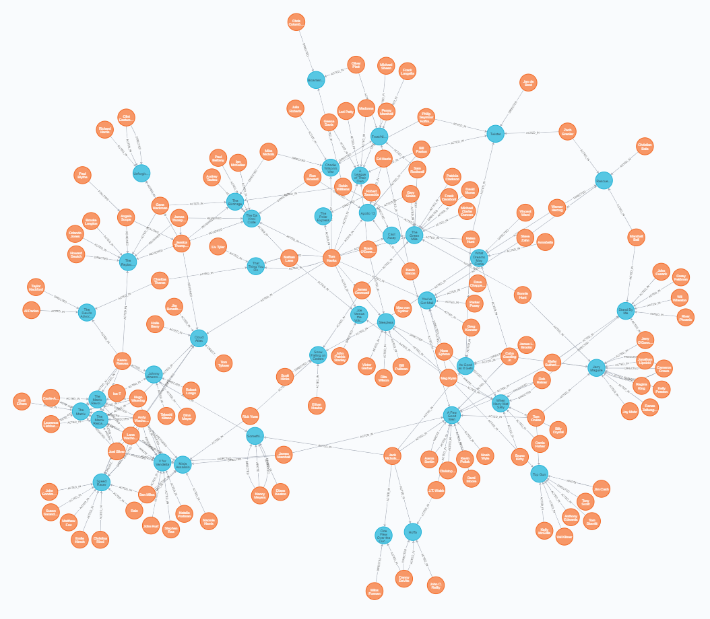
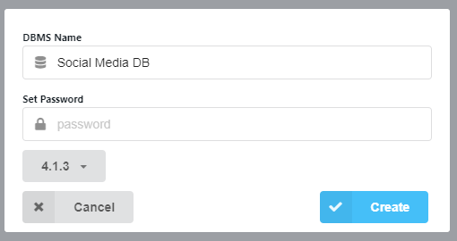
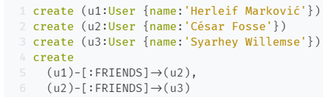
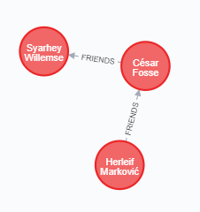
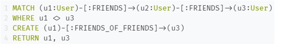
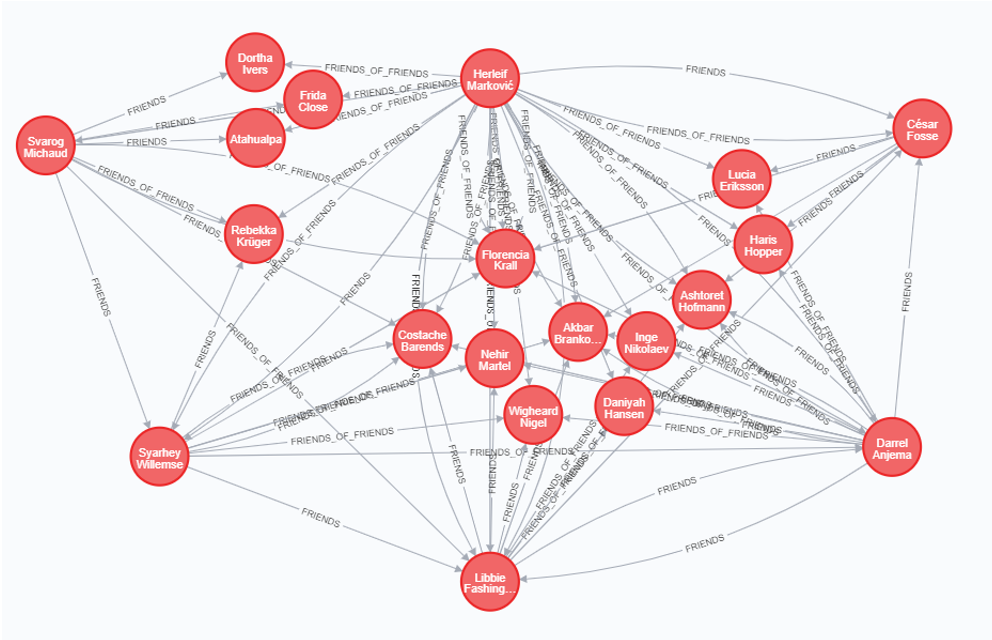

# Лабораторна робота
1. Вивчити документацію: http://www.neo4j.org/learn
2. Встановити на навчальний комп’ютер графову базу даних Neo4j.
3. Запустити базу і протестувати роботу http://localhost:7474

Cypher script для ініціалізацій даних

4. Написати критичний відгук на інтерфейс і можливості роботи з базою даних.

**Переваги**
+ Дуже зрозуміла мова запитів Cypher QL, достатньо інтуїтивна
+ Вбудована підтримка REST API, що робить взаємодію з Neo4J інтуїтивно зрозумілою та простою.
+ Підтримка процедур у Java, процедури - це власний код, який можна додати до Neo4J для написання власних запитів даних.
+ Приємний інтерфейс та інтерфейс для виконання запиту та візуалізації відповіді.
+ Чудове free community edition рішення для невеликих проєктів

**Недоліки**
+ Недостатня документованість для мов відмінних від Java-base libraries
+ Немає підтримки індексів для пошуку даних. Підтримка була б дуже корисною.
+ Backup даних можна було б покращити

#Практичне завдання
1. Створити базову графову модель соціальної мережі, сутність користувач з іменем і зв’язками - друзі.

2. Наповнити базу прикладами користувачів і друзів за допомогою Java АРІ.

Використовуючи Neo4j Java Driver, я наповнив БД користувачами.

3. Наповнити досить великою тестовою колекцією. Взяти дамп Twitter Public Stream.
4. Написати мовою Cypher запити на пошук «друзів друзів». Візу- алізувати засобами бази знайдені кластери друзів.

Підказка до виконання практичної роботи, додаткові матеріали.
1. Neo4j скачати з офіційного сайту, neo4j 2.0.0 community edition for Linux.
2. ПЗ встановити і запустити на http://localhost:7474 командою ~/ neo4j/bin/neo4j start
3. Обрати тематику тестових даних, скачати дані Twitter Public Stream, використовуючи:
https://dev.twitter.com/docs/streaming-apis/connecting
https://dev.twitter.com/docs/streaming-apis/parameters
Далі потрібно зробити таке:
1. Створити твіттер-акаунт для тестування АРІ розробника.
2. Перейти на https://dev.twitter.com/apps і зайти під своїм акаун-
том.
3. Клацнути на «create an application».
4. Погодитися з порядком використання сервісу.
5. На наступній сторінці внизу перейти за посиланням «Create my access token».
6. Скопіювати «Consumer key» і «Consumer secret» y скрипт twitterstream.py.
7. Клацнути на «Create my access token».
8. Відкрити twitterstream.py і встановити значення змінних із свого акаунта.
9. Запустити скрипт для перевірки роботи:
python twitterstream.py.
10. Модифікувати параметри запиту для завантаження тільки потрібних даних.
11. Використати вищенаведені інструкції і скрипт «python twitterstream.py > out.json» для завантаження даних.
12. Розпарсити файл out.json, за допомогою Neo4j Java АРІ покласти у графову базу потрібні дані.
13. Написати запит мовою Cypher на потрібну вам аналітику пов’язаних даних.
14. Відобразити результат у веб-середовшці Neo4j, використавши Neo4j Spatial.
