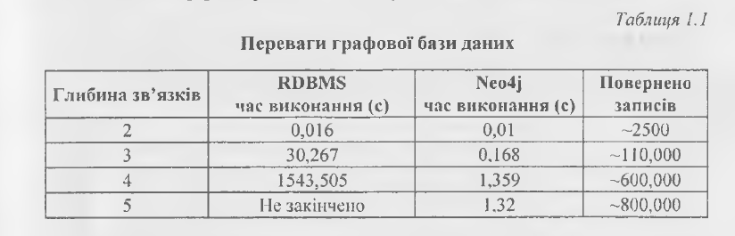

# Конспект
## Графові бази даних
Повернення до ідей графових баз даних в першу чергу' спричинено появою таких сфер інформаційних технологій, як погано структу- ровані дані з класу Big Data, аналіз соціальних мереж і технології семантичного вебу. У багатьох випадках тут необхідно працювати з даними, що пов’язані один з одним, залежать одне від одного, тобто працювати з даними, поданими у вигляді графа, і реляційні СКБД тут не можливо ефективно застосувати.

Однією з головних причин бурхливого розвитку графових баз даних і переконань щодо застосування таких рішень у проектах є вимога продуктивності.

Приріст продуктивності спостерігається при роботі зі пов’язаними даними, глибокого рівня вкла- деності зв’язків. Йдеться про присутній в реляційних базах даних значний спад продуктивності на запитах поєднання таблиць при збільшенні розмірів цих таблиць. З ГБД часова оцінка складності таких запитів прямує до константної. Таким чином, час виконання запиту пропорційний кількості даних, що відповідають умовам запиту, а не розмірам усього графа.

ГБД дозволяють розширювати і удосконалювати модель даних під час уточнення розуміння доменної області, або під час змін пріоритетів бізнесу. Тому таке подання даних уможливлює підтримання інформаційної інфраструктури у відповідності до сьогоденних потреб організацій. Це досягається завдяки адитивній природі графа і зменшує ризики втрати функціональності існуючих запитів при додаванні нових зв’язків або підграфів у модель.

## Графова база Nео4j
Теоретичною основою N604] є модель графів властивостей. Вона складається з трьох основних компонентів:
- властивості — пара «ключ - значення», ключ є рядком, значення може бути довільним типом;
- вершина - контейнер для властивостей, кожна додаткова вершина має власний ідентифікатор (аналог первинного ключа у реляцій- них базах);
- зв’язок - орієнтовне іменоване ребро, яке також може містити властивості та має ідентифікатор.

Вершини зберігаються у файлі neostore.nodestore.db. Кожна вершина займає 9 байт; перший - прапорець, що визначає, чи використовується зараз цей запис (тобто чи не видалений з БД); наступні 4 байти - ідентифікатор першого ребра, приєднаного до вершини; останні 4 - ідентифікатор першої властивості, яку має вершина. Як можна помітити, ідентифікатор самої вершини явно не зберігається - натомість, ідентифікатором кожної з частин виступає її позиція у файлі (тобто вершина з ідентифікатором 100 починається з 900-го (100 х 9) байту у відповідному файлі-сховищі). Таким чином, доступ за ідентифікатором можливо виконувати з часовою складністю 0(1).

Зв’язкизберігаютьсяуфайліпеоБбоге. relationshipstore. db. Кожний запис займає 33 байти: перший - прапорець використання; наступні 4 - ідентифікатор початкової вершини у зв’язку; наступні 4 - ідентифікатор кінцевої вершини у зв’язку; далі 4 байти на ідентифікатор типу зв’язку; наступні 16 байт містять 4-байтні ідентифікатори на наступний та попередній зв’язок початкової та кінцевої вершин; останні 4 байти - ідентифікатор першої властивості, яку має відношення.

Властивості зберігаються у файлі neostore . propertystore. db. Властивості складаються з типу (примітиви JVM, рядки та масиви цих типів), указания на запис у файлі-сховищі індексу властивостей (neostore. propertystore. db. index), указания на запис у динамічному сховищі (neostore .propertystore. db. strings або neostore. propertystore. db. arrays), який містить безпосередньо значення властивості та ідентифікатор наступної властивості вершини/зв’язку.

Доступ до даних здійснюється не напряму, а через дворівневий кеш. На першому рівні знаходиться кеш файлової системи. Кожний файл-сховище розбивається на сторінки, і в кеші тримається задана кількість цих сторінок.

На відміну від багатьох інших NoSQL баз даних, Neo4j підтримує AClD-транзакції, знайомі більшості програмістів за реляційними БД.
Кожна транзакція представлена об’єктом в оперативній пам’яті, який описує операції запису в БД. Також ведеться журнал тран- закцій для забезпечення відновлюваності системи у випадку збою.

<h5> Для обходу графів у Neo4j існує декілька способів: Core АРІ, Traversal Framework, Cypher.</h5>

### Запити і пошук у графовій базі даних.  Мова запитів Cypher

Cypher - декларативна мова запитів для графів, що базується на зіставленні зі зразком (pattern matching). Більш простими словами, використовується проста форма ASCII-графіки, користувач фактично малює частину графа, що його цікавить, за допомогою символів-вершини беруться у дужки, зв’язки відображаються стрілочками, а їх назви зазначаються всередині квадратних дужок.

---
+ START визначає вершину або вершини, з якої (яких) буде розпочато обхід. Можливо отримати вершину за її індексом (як у прикладі) або з індексу за значенням властивості. Обрані вершини прив’язуються до імені, зазначеного користувачем (у нашому випадку user), для подальшого використання у запиті.
+ MATCH описує, які саме частини графа необхідні користувачу, безпосередньо вищезгаданий взірець - «рисунок» підграфа. Якщо існує необхідність визначити декілька взірців, їх розділяють комами.
+ RETURN визначає, які вершини, зв’язки або властивості повернути як результат.
---

Для фільтрації отриманих за допомогою взірців вершин використовується конструкція WHERE. Найчастіше вона використовується для виокремлення вершин, які мають певні значення властивостей. У ній можна використовувати всі вершини та зв’язки, яким ми дали ім’я у конструкціях START та MATCH.

Для простої перевірки наявності певної властивості достатньо використати функцію has.

У конструкції RETURN можна вказувати не лише вершини, а й зв’язки та властивості. Можливе впорядкування результатів за допомогою конструкції ORDER BY (за замовчуванням сортує за зростанням) та обмежувати кількість результатів конструкцією SKIP та LIMIT.

Структура баз даних залежить, насамперед, від структури того, що дані позначають, а також від потреб і обов’язків користувача у відношенні до даних та властивостей носіїв і засобів обробки даних. Чи не в останню чергу структура баз даних залежить від засобів, за допомогою яких вона подається. У нашому випадку це теорія графів. Зробивши її визначальною рисою певного типу баз даних, ми одержуємо одну з найбільш універсальних структур, яку в цьому відношенні можна порівняти з реляційними структурами. З одного боку, це надає розробникам майже нічим не обмежену свободу дій, але з іншого боку, залишає їх один на один з проблемами узгодження структур даних зі структурами того, що позначається, потреб та обов’язків користувача, потенціалів носіїв та засобів обробки даних.
