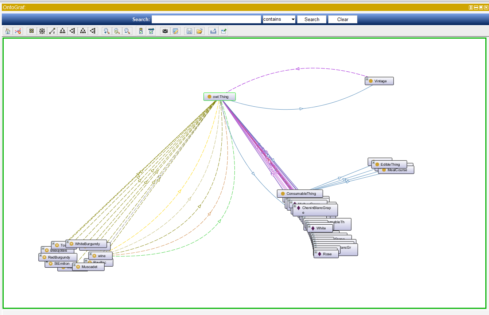

### Protege

З усіх редакторів антологій - найзручніший інтерфейс.
Protégé підтримується значним співтовариством, що складається з розробників і вчених, урядових і корпоративних користувачів, що використовують його для вирішення завдань, пов'язаних зі знаннями, в таких різноманітних галузях, як біомедицина, збір знань і корпоративне моделювання.

Protégé доступний для вільного скачування з офіційного сайту разом з плагінами і онтологіями.

### NeOn

NeOn Toolkit - це мультиплатформенний редактор онтологій з відкритим кодом, який підтримує розробку онтологій у F-Logic та OWL / RDF. Редактор заснований на платформі Eclipse і надає набір плагінів (наразі 20 плагінів доступні для останньої версії, v2.4), що охоплює ряд інженерних заходів онтології, включаючи анотації та документацію, модуляризацію та налаштування, Повторне використання, еволюція онтології, переклад [1] та інші.

### HOZO

Hozo - графічний редактор онтологій, спеціально створений для створення важких онтологій. [1] Він був розроблений в Японії завдяки партнерству між Департаментом систем знань (Лабораторія Мізогуті), Університетом ISIR-Осака та Enegate Co, Ltd.
