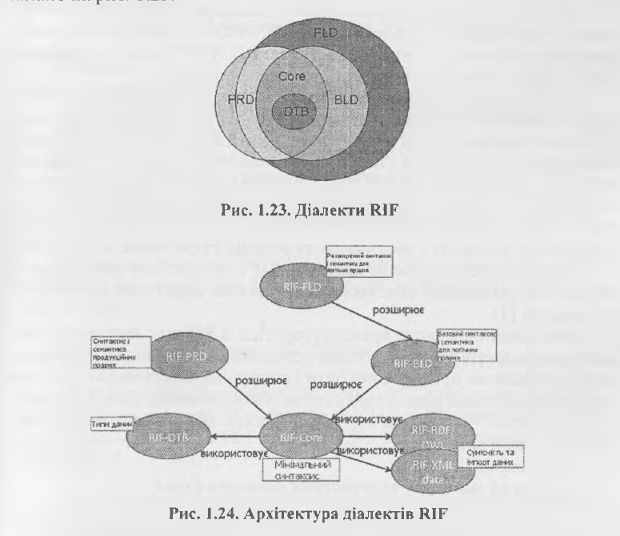

## Формат обміну правилами (RIF)
Правила надають можливість природного моделювання знання. Загальний формат запису правил такий:
````
тіло правила -> голова 
     або 
голова:-тіло,
````

де «тіло» (може бути порожнє) - це кон’юнкція атомів, а «голова» - найчастіше один атом чи диз’юнкція атомів.
Приклади:
````
V х V у ( hasSister(x, у) -> hasSibling(x, у))
V х ( Маіе(х) Л Female(x) -> Т).
````

### Загальна характеристика
Формат обміну правилами (R1F) є рекомендацією консорціуму W3C. Це XML-мова для вираження правил. На сьогодні існує багато мов опису правил, і все, що потрібно, - це коректний обмін правилами між ними.
Оскільки різні мови правил можуть мати великі розбіжності в дизайні, RIF має декілька версій, які називаються діалектами.

RIF є форматом обміну правилами через Інтернет. Правила, якими обмінюються з використанням RIF, можуть належати до зовнішніх джерел даних і можуть бути базовані на моделі даних, яка представлена з використанням мови, відмінної від R1F.

### Архітектура, синтаксис і семантика
RIF спроектований як множина RIF-діалектів. Основних діалекті гри: 
+ RIF Core Dialect
+ Basic Logic Dialect 
+ Production Rule Dialect.

Їх об'єднує RIF Framework for Logic Dialects.



Кожен діалект — це набір компонентів, які працюють спільно, утворюючи мову-посередник. Нові діалекти необхідні для тих випадків, в яких жоден з існуючих діалектів не надає необхідних мовних правил для обміну.

+ RIF Framework for Logic-based Dialects (RIF-FLD) описує механізми для визначення синтаксису та семантики діалектів RIF через ряд загальних понять.
+ RIF-BLD (Basic Logic Dialect) є спеціалізацією RIF-FLD. RIF-BLD відповідає мові визначених правил Хорна з рівністю і стандартній семантиці першого порядку. Синтаксично RIF-BLD має ряд розширень для підтримки об’єктів, фреймів та F-логіки, інтернаціоналізації, IRI та схем XML.
+ RIF-PRD (Production Rules Dialect) визначає діалект для обміну правилами створення. Імплементація RIF-PRD - це програмний додаток серіалізії продукційних правил RIF-PRD XML та/або десеріаліза- ції RIF-PRD XML-документів у продукційні правила.
+ RIF-Core (Core Dialect) визначає загальний набір RIF- BLD і RIF- PRD, що містить RIF-DTB (RIF Data Types). З теоретичної точки зору RIF-Core відповідає мові визначених правил Хорна без функціональних символів (Datalog) зі стандартною семантикою першого порядку. RIF-Core є підмножиною RIF-BLD. У той же час він є мовою створення правил, де висновки інтерпретуються як підтвердження дій.


Семантика діалектів відрізняється між собою за синтаксисом, значенням істини, типами даних, логічним виведенням.
Модель теоретичної семантики RIF BLD обмежується базовим синтаксисом. У ній немає підкласів, логічних функцій, іменованих аргументів - є тільки атоми і фрейми. У RIF PRD немає заперечення і присутня Pattern2Condition еквівалентність.
RIF-BLD не підтримує заперечення. Множина значень істинос- ті в RIF-BLD складається всього з двох значень - Т і F, так що F < Т. Наявні такі типи даних: xsddong, xsddnteger, xsd:decimal, xsd:string, xsditime, xsd:dateTime, rdf:XMLLiteral, rif:text.

### Приклади задавання правил

Приклад RIF Core /3]
1. Покупець купує товар у продавця, якщо продавець згоден його продати покупцю.
2. Джон продає книгу «SemanticWeb» Мері.
Document(
Prefix(cpt <http://example.eom/concepts#>)
Prefix(ppl <http://example.eom/people#>)
Prefix(bks <http://example.eom/books#>)
Group (
Forall ?Buyer ?ltem ?Seller (
cpt:buy(?Buyer ‘/Item ‘/Seller):- cpt:sell(?Seller ?Item ?Buyer)
)
cpt:sell(ppl:John bks: SemanticWeb ppkMary)
)
)•

Приклад RIF-BLD /4]
1. Якщо канал управління повідомляє, що зафіксовано сигнал з певного пристрою, то цей пристрій використовується.
Document(
Prefix(pred http://www.w3.Org/2007/rif-builtin-predicate#) Prefix(func http://www.w3.Org/2007/rif-builtin-function#)
Prefix(ex <http://example.eom/2009/ucr4.2.3#>)
Group(
Forall ?device ?band ?user ?controlchannel If And (ex:iscontrolchannel(controlchannel) ex:communicatesignal(?controlchannel ?user ?device ?band))
Then Do (Assert (ex:useband(?user ?band)))
)
)

Приклад RJF-PRD /6]
1. Якщо «срібний» покупець за рік купить товару на суму більше 2000, то він стає «золотим» покупцем.
Document(
Prefix( exl <http://example.com/2009/prd2> )
Group (
Forall ?customer such that And(?customer # exl :Customer ?customer[exl :status -> «Silver»])
(Forall ?shoppingCart such that ?customer[exl:shoppingCart -> ?shoppingCart]
(If Exists ?value (And(?shoppingCart[exEvalue -> ?value] External(pred:numeric-greater-than-or-equal(?value 2000))))
Then Do(Modify(?customer[exl :status -> «Gold»]))))).

### RIF + RDF/OWL

Типовий сценарій використання RIF спільно з RDF/OWL полягає в обміні правилами, які використовують дані з RDF і/або OWL.
Розглянемо такий сценарій. Нехай А має мову' правил, що підтримує RDF-дані, використовує RDFS- або OWL-онтологію чи розширює RDF(S)/OWL. А посилає свої правила, використовуючи RIF, можливо з посиланням на відповідний RDF-граф (або графи), партнеру Б. Б отримує правила і відновлює RDF-граф (графи), на які є посилання. Ці правила транслюються у внутрішню мову Б і обробляються разшм з RDF-графами механізмом виведення (rule engine) Б, що підтримує RDF/OWL.

### RIF + RDF
RIF-документ (множина правил) R може імпортувати RDF/OWL- документ, використавши:
Import(graphLocation profile ),
де graphLocation - розташування RDF графа; a profile - параметр інтерпретування RDF-графа (наприклад, RDFS, OWL DL).
Комбінація RIF-RDF - це кортеж С = (Л,{>У1,...,б'л}). Комбінація RIF-OWL DL - це кортеж С = (Л, {01,...,0„}), де О І...On - це OWL- онтологія в абстрактній синтаксичній формі.

