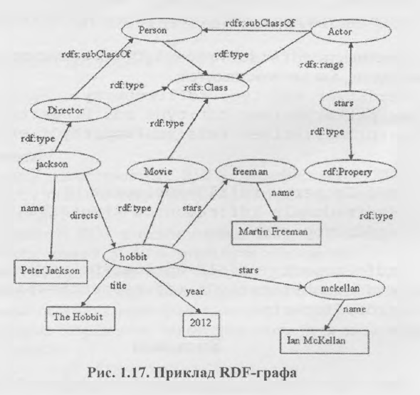
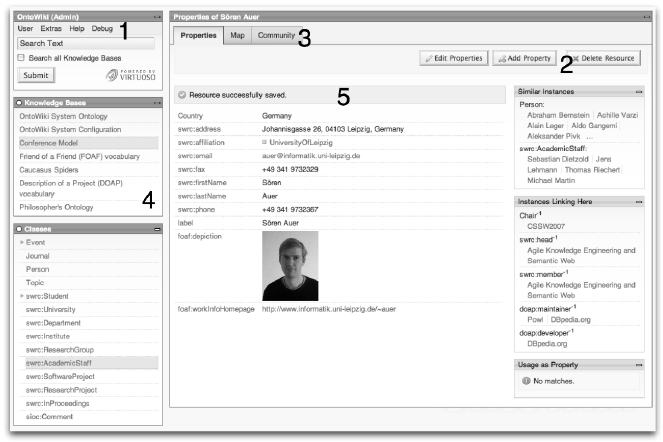
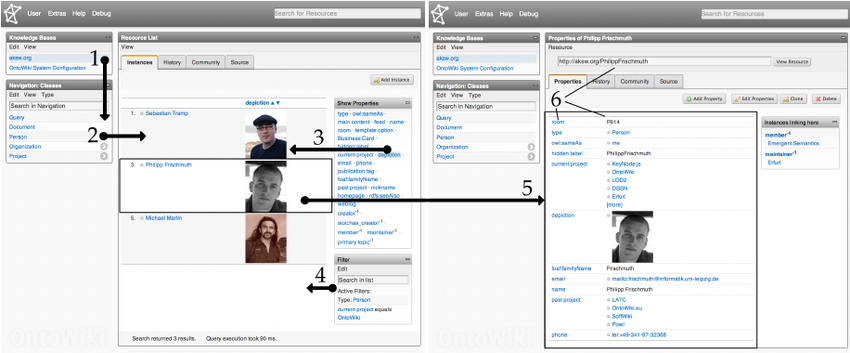

<http://ontowiki.net/>

OntoWiki - це інтерфейсний додаток для Web Semantic Data, який спочатку
був розроблений для підтримки сценаріїв розподіленої інженерії знань.
Завдяки своїй розширюваності він також служить основою для розробки
наукомістких програм. На перший погляд, OntoWiki - це загальний
користувальницький інтерфейс для довільних графіків знань RDF. Він
підтримує навігацію по базах знань RDF за допомогою створених SPARQL
списків, таблиць та дерев. Усі ресурси автоматично представляються у
вигляді гіперпосилань, а зворотні посилання створюються, коли це
можливо, що дозволяє користувачам легко переходити через цілі графіки
знань. Оскільки всі колекції ресурсів, що відображаються в OntoWiki,
генеруються за допомогою запитів SPARQL, їх можна додатково уточнити,
застосувавши додаткові фільтри. Для вивчення великих наборів даних був
інтегрований комплексний метод управління статистичними даними та
візуалізації.

OntoWiki полегшує візуальне представлення бази знань як інформаційну
карту з різними поглядами на дані екземплярів. Це забезпечує інтуїтивне
створення семантичного вмісту за допомогою вбудованого режиму
редагування для внесення змін до вмісту RDF.

OntoWiki в основному розробляється дослідницькою групою Agile Knowledge
Engineering and Semantic Web (AKSW) при Лейпцігському університеті,
групою, також відомої, зокрема, завдяки проекту DBpedia, у співпраці з
волонтерами з усього світу.

Остання версія 1.0.0 вийшла у 2016 році

**Для чого потрібна?**

Керування своїми знаннями, а саме машиночитані дані типу RDF/XML,
Notation3, Turtle, Talis(JSON). Організація знань за допомогою
багатофункціонального інтерфейсу користувача, що керує класами,
властивостями та ресурсами.

1\) image rendered by plugin, 2) module window, 3) main content provided
by component, 4) different types of menus, 5) toolbar and 6) navigation.

1)  menu, 2) toolbar, 3) navigation, 4) module window and 5) message.

> 

Крім того, що OntoWiki може зробити для вас:

-   Надання багатофункціонального інтерфейсу для допомоги в організації
    та керуванні ресурсами, взаємозв'язків між ресурсами, класами \....
    Ми активно використовуємо сучасні браузерні технології, щоб
    забезпечити вам зручнішу роботу.

-   Це сервер зв'язаних даних для вашої інформації, а також клієнт
    зв'язаних даних для отримання додаткової інформації з Інтернету

-   Ви можете використовувати відомий сервер для зберігання своїх даних,
    оскільки OntoWiki не залежить від серверної бази, а це означає, що
    ви можете зберігати свої дані навіть в базі даних MySQL.

OntoWiki надає багатий набір розширень.

-   Вікіпедія, як Вікі: створюйте вікі-сторінки за допомогою Markdown і
    має можливість приєднати вікі-сторінки до існуючих ресурсів

-   Розширення з назвою CubeViz для візуалізації статистичних даних, які
    організовані у форматі DataCube. OntoWiki + CubeViz вже
    використовуються для порталу відкритих даних Європейського Союзу!

-   Інтеграція карт - якщо ваші дані містять географічну інформацію, ви
    можете їх побачити на карті

**Переваги**

-   Веб-інтерфейс, підтримуваний основними браузерами.

> Можна створювати бази знань, створювати, планувати, передивлятися
> ресурси.
>
> Схоже на Protégé

-   Багатий набір розширень. Наприклад для імпортування різних джерел,
    плагіни для створення markdown сторінок

-   Production-ready(використовується для відкритих даних Європейського
    союзу)

-   Досі підтримується

**Недоліки**

• Багато залежностей, а отже важко запустити локально

• Дещо застарілий інтерфейс

Загальні недоліки вікі-систем

• Дублювання даних (неузгоджений зміст)

• Важко знайти з великої вибірки необхідну інформацію

• Відсутність типізованих властивостей, а отже і ускладнення
класифікації

**Висновки**

OntoWiki -- одне з найкращих рішень в інтернеті для семантичних вікі, бо
активно підтримується, зокрема з боку ЄС.

Має широкий функціонал і мережу розширень, проте бракує зрозумілості
дизайну.

Ідеально підходить для великих організацій, що мають ресурси розвернути
інфраструктуру (щоб розвернути сервер) , в той час як для
індивідуального використання не дуже підходить
